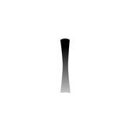
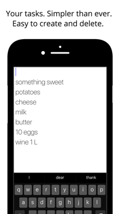
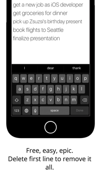
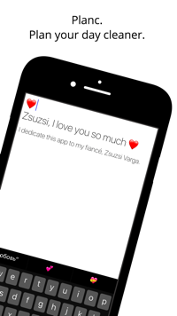

# Planc

Planc - minimalistic open-source to-do list written in Swift 3. It is so minimalistic so it was rejected from App Store. 
If you have any questions about Planc, please feel free to email me anytime at danil@chernyshev.pro.

I am aspiring iOS developer and UI/UX designer, I live and breath in iOS environment. I will be happy to be a part of any passionate iOS team 
to create real-life applications. If you are interested in me as a part of your team, please email me at danil@chernyshev.pro

Now I am working on my second app called Mnemmal. It is word learning app and it uses cards not in usual way with some social networking element.
Stay tuned!

# License

Copyright by Chernyshev Danil, 2017.

Permission is hereby granted, free of charge, to any person obtaining a copy of this software and associated documentation files (the "Software"), to deal in the Software without restriction, including without limitation the rights to use, copy, modify, merge, publish, distribute, sublicense, and/or sell copies of the Software, and to permit persons to whom the Software is furnished to do so, subject to the following conditions:

The above copyright notice and this permission notice shall be included in all copies or substantial portions of the Software.

THE SOFTWARE IS PROVIDED "AS IS", WITHOUT WARRANTY OF ANY KIND, EXPRESS OR IMPLIED, INCLUDING BUT NOT LIMITED TO THE WARRANTIES OF MERCHANTABILITY, FITNESS FOR A PARTICULAR PURPOSE AND NONINFRINGEMENT. IN NO EVENT SHALL THE AUTHORS OR COPYRIGHT HOLDERS BE LIABLE FOR ANY CLAIM, DAMAGES OR OTHER LIABILITY, WHETHER IN AN ACTION OF CONTRACT, TORT OR OTHERWISE, ARISING FROM, OUT OF OR IN CONNECTION WITH THE SOFTWARE OR THE USE OR OTHER DEALINGS IN THE SOFTWARE.
